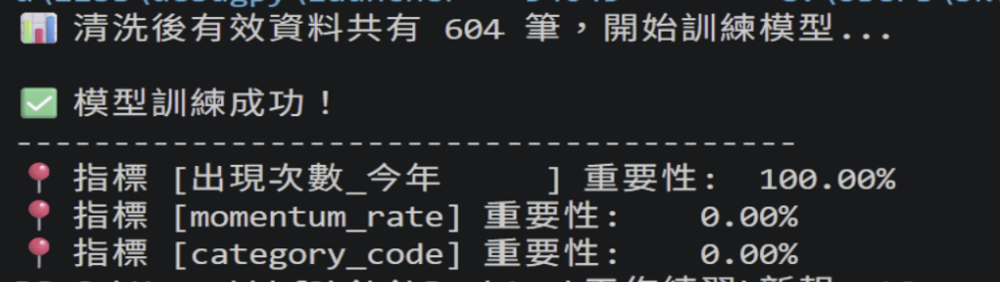
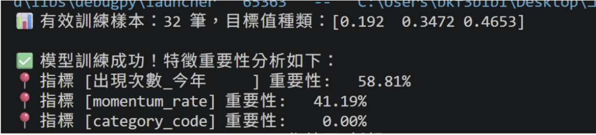
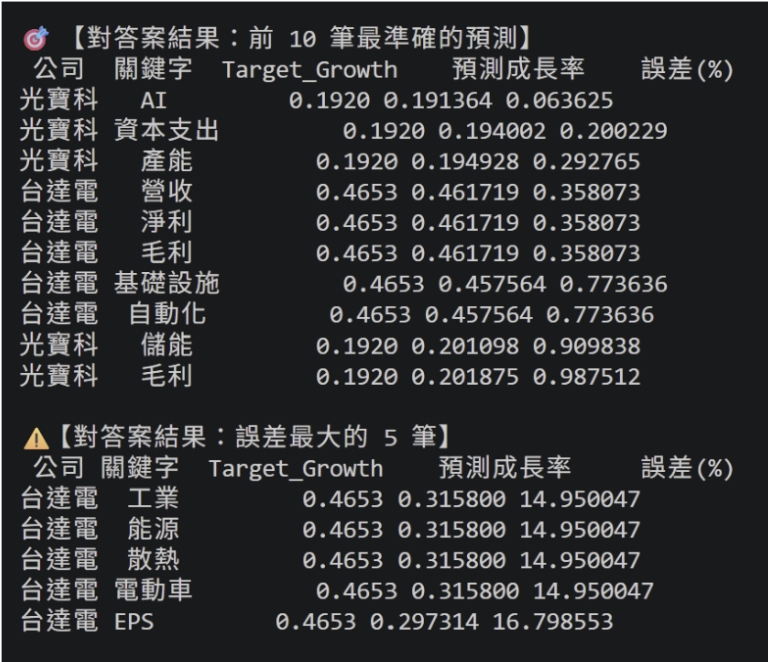

##  專案核心檔案連結
為了方便快速評閱，以下為本專案之核心代碼與數據分析結果：

### 🐍 核心程式碼 (Python Scripts)
* **[機器學習模型預測 (XGBoost)](./機器學習多檔案.py)**：包含特徵訓練與重要性分析之核心邏輯。
* **[關鍵詞提取完整流程](./關鍵詞完整流程多檔案.py)**：展示如何從質化文本轉化為量化特徵的清洗過程。
* **[企業特徵表產生工具](./產生企業成長動能特徵表EXCEL多檔案.py)**：自動化產生分析所需之 Excel 報表。

### 📊 數據與分析結果 (Data & Results)
* **[模型預測結果對照表](./模型預測對照表.xlsx)**： 包含真實營收成長率與模型預測值之對比。
* **[多檔案統計結果 (含上下文)](./多檔案統計結果_含上下文.xlsx)**：深入分析關鍵字在文本中的原始語境。
* **[多檔案統計結果匯總](./多檔案統計結果.xlsx)**：各關鍵字出現頻率之量化統計。
# 法說會語意動能與營收成長預測模型 (XGBoost)

使用XGBoost演算法下去做企業營收成長的預測模型，利用機器學習技術，將企業法說會的文本利用jieba進行中文斷詞，將非結構化的法說會文本轉化為可統計的詞頻矩陣，構建語意特徵轉化為量化指標，即可預測企業未來的營收成長率。

##  核心動機：挖掘文字裡的領先指標
在目前的量化分析中，多數模型過度依賴**財報數據（落後指標）**。本專案旨在驗證：企業在法說會中釋出的**展望語意**，是否能作為預測未來的領先指標。

我開發了一套 Python 自動化工具，將質化的法說會 PDF 轉化為量化的「成長動能特徵」，藉此捕捉管理層對未來營運的信心程度。

---

##  實作流程與技術挑戰
在開發過程中，我經歷了兩次核心的技術疊代，這不僅優化了模型，也讓我對數據清洗與機器學習邏輯有了更深的理解：

### 1. 數據提取與清洗 (NLP Pre-processing)
* **遇到的挑戰**：初期提取出的詞頻極其雜亂，包含大量無意義的術語（Noise），導致模型特徵模糊，無法抓到重點。
* **解決方案**：重新優化詞庫篩選邏輯，聚焦於具備**產業驅動力**的關鍵字（如：`AI`、`CoWoS`、`伺服器`），確保輸入數據具備業務含金量與預測價值。

### 2. 模型訓練與樣本優化 (XGBoost Modeling)
* **遇到的挑戰**：最初僅使用單一公司的數據，導致模型因缺乏「對照組」而產生**過度擬合（Overfitting）**，特徵權重出現極端偏誤。
 
* **解決方案**：擴充異質樣本至**台積電、台達電、光寶科**等多家指標性企業。在整合 32 筆具備不同成長位階的樣本後，模型成功學會辨識特徵與營收成長（Target_Growth）之間的關聯。

---

##  三大數據發現與商業價值
透過 XGBoost 模型的特徵重要性分析（Feature Importance），我得到了以下實戰洞察：

1.  **量化強度 (58.8%)**：指標 **[出現次數_今年]** 佔比最高。證實管理層對特定領域的強調頻率與業績成正相關。
2.  **趨勢動能 (41.2%)**：指標 **[動能變化率 (Momentum)]** 佔比顯著。證明「今年比去年進步多少」是捕捉業績轉折點的關鍵信號。
3.  **預測能力驗證**：儘管目前樣本規模尚小，但模型已能有效區分不同指標的重要性，驗證了這套「語意量化邏輯」在量化投資決策中具備極高的開發潛力。

---

##  未來展望
* **擴展數據源**：增加樣本數，計畫將模型擴展至全產業法說會數據，提升模型的泛化能力。
* **情緒分析介入**：引入 NLP 情緒分析 (Sentiment Analysis)，區分管理層發言的正面與負面權重，進一步降低預測殘差。

---
**技術棧 (Tech Stack):** Python, XGBoost, Pandas, Matplotlib, NLP Data Cleaning

